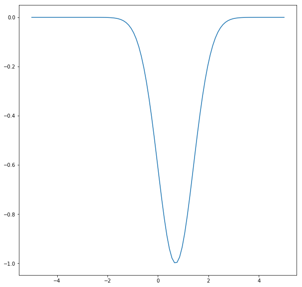
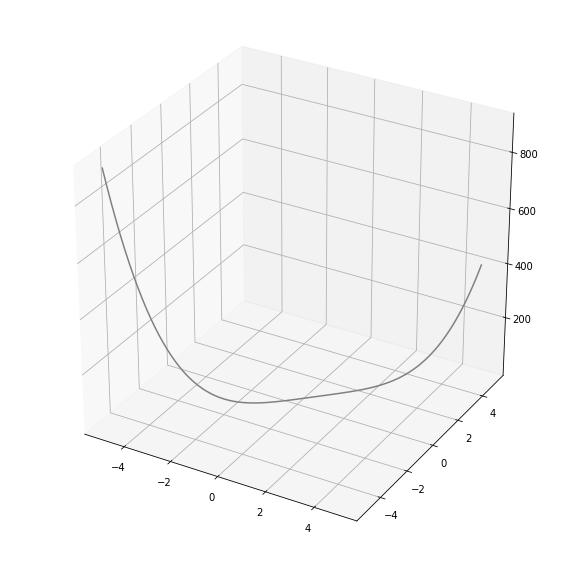

# Homework/LAB 1 Assignment - Iterative Optimization

## Question. 1 - Solving minimization problem with iteration gradient descent method

### Q1(a) : f(x) = -e^(-(x - 0.7)^2)

### Q1(b): f(x0,x1) = .5*(1 - x0)^2 + (x1 - x0^2)^2

### NOTE: Solving by hand and show all steps. 

## Question. 2 - Implement your gradient solving approach in python using Numpy

### Q2(a) : f(x) = -e^(-(x - 0.7)^2)

### Q2(b): f(x0,x1) = .5*(1 - x0)^2 + (x1 - x0^2)^2

### NOTE: Implement an interative solving approach and discuss whether it matches your results in Q1

## Question. 3 - Verify your function using the code below.


```python
from scipy import optimize
import numpy as np
import matplotlib.pyplot as plt
```


```python
def f1(x):
    return -np.exp(-(x - 0.7)**2)
```


```python
plt.figure(figsize=(10,10))
x = np.linspace(-5, 5, 100)
plt.plot(x,f1(x))
```


    [<matplotlib.lines.Line2D at 0x120219450>]


    

    


```python
result = optimize.minimize_scalar(f1)
print(result.success) #check if solver was successful
x_min = result.x # print result
print(x_min)
```

    True
    0.6999999997839409


```python
def f2(x):   # The rosenbrock function
    return .5*(1 - x[0])**2 + (x[1] - x[0]**2)**2

x0 = np.linspace(-5, 5, 100)
x1 = np.linspace(-5, 5, 100)
x = [x0,x1]
f2(x)
```


    array([9.18000000e+02, 8.52556555e+02, 7.90682231e+02, 7.32244735e+02,
           6.77114272e+02, 6.25163546e+02, 5.76267760e+02, 5.30304615e+02,
           4.87154310e+02, 4.46699542e+02, 4.08825509e+02, 3.73419906e+02,
           3.40372924e+02, 3.09577256e+02, 2.80928091e+02, 2.54323119e+02,
           2.29662527e+02, 2.06848999e+02, 1.85787719e+02, 1.66386371e+02,
           1.48555134e+02, 1.32206688e+02, 1.17256211e+02, 1.03621378e+02,
           9.12223647e+01, 7.99818434e+01, 6.98249858e+01, 6.06794618e+01,
           5.24754397e+01, 4.51455863e+01, 3.86250669e+01, 3.28515452e+01,
           2.77651834e+01, 2.33086420e+01, 1.94270800e+01, 1.60681551e+01,
           1.31820231e+01, 1.07213384e+01, 8.64125386e+00, 6.89942079e+00,
           5.45598891e+00, 4.27360642e+00, 3.31741996e+00, 2.55507461e+00,
           1.95671392e+00, 1.49497985e+00, 1.14501286e+00, 8.84451810e-01,
           6.93434048e-01, 5.54595350e-01, 4.53069944e-01, 3.76490508e-01,
           3.14988171e-01, 2.61192507e-01, 2.10231542e-01, 1.59731748e-01,
           1.09818049e-01, 6.31138162e-02, 2.47408690e-02, 2.31947663e-03,
           5.96835708e-03, 4.83046770e-02, 1.44444052e-01, 3.12000546e-01,
           5.71086674e-01, 9.44313396e-01, 1.45679012e+00, 2.13612472e+00,
           3.01242348e+00, 4.11829118e+00, 5.48883102e+00, 7.16164465e+00,
           9.17683218e+00, 1.15769922e+01, 1.44072216e+01, 1.77151159e+01,
           2.15507691e+01, 2.59667734e+01, 3.10182196e+01, 3.67626970e+01,
           4.32602933e+01, 5.05735947e+01, 5.87676857e+01, 6.79101493e+01,
           7.80710671e+01, 8.93230190e+01, 1.01741083e+02, 1.15402837e+02,
           1.30388355e+02, 1.46780212e+02, 1.64663479e+02, 1.84125728e+02,
           2.05257026e+02, 2.28149943e+02, 2.52899543e+02, 2.79603391e+02,
           3.08361550e+02, 3.39276582e+02, 3.72453546e+02, 4.08000000e+02])


```python
from mpl_toolkits.mplot3d import Axes3D # <--- This is important for 3d plotting 

plt.figure(figsize=(10,10))
ax = plt.axes(projection='3d')
ax.plot3D(x[0], x[1], f2(x), 'gray')

```


    [<mpl_toolkits.mplot3d.art3d.Line3D at 0x12047f910>]


    

    


```python
optimize.minimize(f2, x, method="CG") 
```


         fun: 1.6660750637866436e-11
         jac: array([-1.4159522e-06, -2.0371710e-06,  0.0000000e+00,  0.0000000e+00,
            0.0000000e+00,  0.0000000e+00,  0.0000000e+00,  0.0000000e+00,
            0.0000000e+00,  0.0000000e+00,  0.0000000e+00,  0.0000000e+00,
            0.0000000e+00,  0.0000000e+00,  0.0000000e+00,  0.0000000e+00,
            0.0000000e+00,  0.0000000e+00,  0.0000000e+00,  0.0000000e+00,
            0.0000000e+00,  0.0000000e+00,  0.0000000e+00,  0.0000000e+00,
            0.0000000e+00,  0.0000000e+00,  0.0000000e+00,  0.0000000e+00,
            0.0000000e+00,  0.0000000e+00,  0.0000000e+00,  0.0000000e+00,
            0.0000000e+00,  0.0000000e+00,  0.0000000e+00,  0.0000000e+00,
            0.0000000e+00,  0.0000000e+00,  0.0000000e+00,  0.0000000e+00,
            0.0000000e+00,  0.0000000e+00,  0.0000000e+00,  0.0000000e+00,
            0.0000000e+00,  0.0000000e+00,  0.0000000e+00,  0.0000000e+00,
            0.0000000e+00,  0.0000000e+00,  0.0000000e+00,  0.0000000e+00,
            0.0000000e+00,  0.0000000e+00,  0.0000000e+00,  0.0000000e+00,
            0.0000000e+00,  0.0000000e+00,  0.0000000e+00,  0.0000000e+00,
            0.0000000e+00,  0.0000000e+00,  0.0000000e+00,  0.0000000e+00,
            0.0000000e+00,  0.0000000e+00,  0.0000000e+00,  0.0000000e+00,
            0.0000000e+00,  0.0000000e+00,  0.0000000e+00,  0.0000000e+00,
            0.0000000e+00,  0.0000000e+00,  0.0000000e+00,  0.0000000e+00,
            0.0000000e+00,  0.0000000e+00,  0.0000000e+00,  0.0000000e+00,
            0.0000000e+00,  0.0000000e+00,  0.0000000e+00,  0.0000000e+00,
            0.0000000e+00,  0.0000000e+00,  0.0000000e+00,  0.0000000e+00,
            0.0000000e+00,  0.0000000e+00,  0.0000000e+00,  0.0000000e+00,
            0.0000000e+00,  0.0000000e+00,  0.0000000e+00,  0.0000000e+00,
            0.0000000e+00,  0.0000000e+00,  0.0000000e+00,  0.0000000e+00,
            0.0000000e+00,  0.0000000e+00,  0.0000000e+00,  0.0000000e+00,
            0.0000000e+00,  0.0000000e+00,  0.0000000e+00,  0.0000000e+00,
            0.0000000e+00,  0.0000000e+00,  0.0000000e+00,  0.0000000e+00,
            0.0000000e+00,  0.0000000e+00,  0.0000000e+00,  0.0000000e+00,
            0.0000000e+00,  0.0000000e+00,  0.0000000e+00,  0.0000000e+00,
            0.0000000e+00,  0.0000000e+00,  0.0000000e+00,  0.0000000e+00,
            0.0000000e+00,  0.0000000e+00,  0.0000000e+00,  0.0000000e+00,
            0.0000000e+00,  0.0000000e+00,  0.0000000e+00,  0.0000000e+00,
            0.0000000e+00,  0.0000000e+00,  0.0000000e+00,  0.0000000e+00,
            0.0000000e+00,  0.0000000e+00,  0.0000000e+00,  0.0000000e+00,
            0.0000000e+00,  0.0000000e+00,  0.0000000e+00,  0.0000000e+00,
            0.0000000e+00,  0.0000000e+00,  0.0000000e+00,  0.0000000e+00,
            0.0000000e+00,  0.0000000e+00,  0.0000000e+00,  0.0000000e+00,
            0.0000000e+00,  0.0000000e+00,  0.0000000e+00,  0.0000000e+00,
            0.0000000e+00,  0.0000000e+00,  0.0000000e+00,  0.0000000e+00,
            0.0000000e+00,  0.0000000e+00,  0.0000000e+00,  0.0000000e+00,
            0.0000000e+00,  0.0000000e+00,  0.0000000e+00,  0.0000000e+00,
            0.0000000e+00,  0.0000000e+00,  0.0000000e+00,  0.0000000e+00,
            0.0000000e+00,  0.0000000e+00,  0.0000000e+00,  0.0000000e+00,
            0.0000000e+00,  0.0000000e+00,  0.0000000e+00,  0.0000000e+00,
            0.0000000e+00,  0.0000000e+00,  0.0000000e+00,  0.0000000e+00,
            0.0000000e+00,  0.0000000e+00,  0.0000000e+00,  0.0000000e+00,
            0.0000000e+00,  0.0000000e+00,  0.0000000e+00,  0.0000000e+00,
            0.0000000e+00,  0.0000000e+00,  0.0000000e+00,  0.0000000e+00,
            0.0000000e+00,  0.0000000e+00,  0.0000000e+00,  0.0000000e+00])
     message: 'Optimization terminated successfully.'
        nfev: 4444
         nit: 10
        njev: 22
      status: 0
     success: True
           x: array([ 0.99999441,  0.9999878 , -4.7979798 , -4.6969697 , -4.5959596 ,
           -4.49494949, -4.39393939, -4.29292929, -4.19191919, -4.09090909,
           -3.98989899, -3.88888889, -3.78787879, -3.68686869, -3.58585859,
           -3.48484848, -3.38383838, -3.28282828, -3.18181818, -3.08080808,
           -2.97979798, -2.87878788, -2.77777778, -2.67676768, -2.57575758,
           -2.47474747, -2.37373737, -2.27272727, -2.17171717, -2.07070707,
           -1.96969697, -1.86868687, -1.76767677, -1.66666667, -1.56565657,
           -1.46464646, -1.36363636, -1.26262626, -1.16161616, -1.06060606,
           -0.95959596, -0.85858586, -0.75757576, -0.65656566, -0.55555556,
           -0.45454545, -0.35353535, -0.25252525, -0.15151515, -0.05050505,
            0.05050505,  0.15151515,  0.25252525,  0.35353535,  0.45454545,
            0.55555556,  0.65656566,  0.75757576,  0.85858586,  0.95959596,
            1.06060606,  1.16161616,  1.26262626,  1.36363636,  1.46464646,
            1.56565657,  1.66666667,  1.76767677,  1.86868687,  1.96969697,
            2.07070707,  2.17171717,  2.27272727,  2.37373737,  2.47474747,
            2.57575758,  2.67676768,  2.77777778,  2.87878788,  2.97979798,
            3.08080808,  3.18181818,  3.28282828,  3.38383838,  3.48484848,
            3.58585859,  3.68686869,  3.78787879,  3.88888889,  3.98989899,
            4.09090909,  4.19191919,  4.29292929,  4.39393939,  4.49494949,
            4.5959596 ,  4.6969697 ,  4.7979798 ,  4.8989899 ,  5.        ,
           -5.        , -4.8989899 , -4.7979798 , -4.6969697 , -4.5959596 ,
           -4.49494949, -4.39393939, -4.29292929, -4.19191919, -4.09090909,
           -3.98989899, -3.88888889, -3.78787879, -3.68686869, -3.58585859,
           -3.48484848, -3.38383838, -3.28282828, -3.18181818, -3.08080808,
           -2.97979798, -2.87878788, -2.77777778, -2.67676768, -2.57575758,
           -2.47474747, -2.37373737, -2.27272727, -2.17171717, -2.07070707,
           -1.96969697, -1.86868687, -1.76767677, -1.66666667, -1.56565657,
           -1.46464646, -1.36363636, -1.26262626, -1.16161616, -1.06060606,
           -0.95959596, -0.85858586, -0.75757576, -0.65656566, -0.55555556,
           -0.45454545, -0.35353535, -0.25252525, -0.15151515, -0.05050505,
            0.05050505,  0.15151515,  0.25252525,  0.35353535,  0.45454545,
            0.55555556,  0.65656566,  0.75757576,  0.85858586,  0.95959596,
            1.06060606,  1.16161616,  1.26262626,  1.36363636,  1.46464646,
            1.56565657,  1.66666667,  1.76767677,  1.86868687,  1.96969697,
            2.07070707,  2.17171717,  2.27272727,  2.37373737,  2.47474747,
            2.57575758,  2.67676768,  2.77777778,  2.87878788,  2.97979798,
            3.08080808,  3.18181818,  3.28282828,  3.38383838,  3.48484848,
            3.58585859,  3.68686869,  3.78787879,  3.88888889,  3.98989899,
            4.09090909,  4.19191919,  4.29292929,  4.39393939,  4.49494949,
            4.5959596 ,  4.6969697 ,  4.7979798 ,  4.8989899 ,  5.        ])


```python

```
